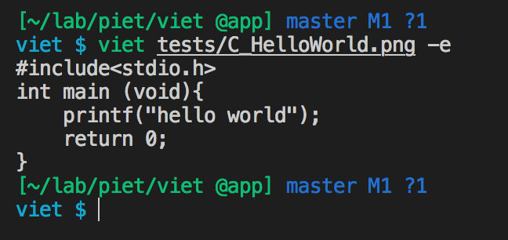

# TODO
今分かりにくいので一旦全部リファクタリングしたい...
そろそろ設計が気持ち悪くなってきた機がする (confクラスを作成してあげたい|orderandsize/orderandargsとか止めたい)
common:
pietbase:
curse:
asm <-> piet -> cpp
stegano : asm + image -> piet

# 機能
- topiet : vpiet -> 回路図 Piet
- steganopiet : ステガノっぽいPietを生成

# vpiet
1. can execute Piet on CUI ! (high speed !! big png file supported !!)
2. can edit Piet on CUI ! (Cool!!)

# Install
```
### install nim
$ curl https://nim-lang.org/choosenim/init.sh -sSf | sh
$ echo 'export PATH=~/.nimble/bin:$PATH' >> ~/.bashrc
### install vpiet
$ git clone git@github.com:Muratam/vpiet.git
$ cd vpiet
$ nimble install
```

# Usage
```
$ vpiet <filename>     # edit
$ vpiet -e <filename>  # execute
```

# Edit




# FAQ
- codel size :: 1
- utf-8 support
- undefined behaviour (error)
  - divide by zero
  - modulo by zero
  - negative depth roll
  - greater than stack size roll
- IN(Number) / IN(Char) example:
  - inn inc at `100 a` -> [100,20(=SPACE)]
  - inn inn at `100 200` -> [100,200]
